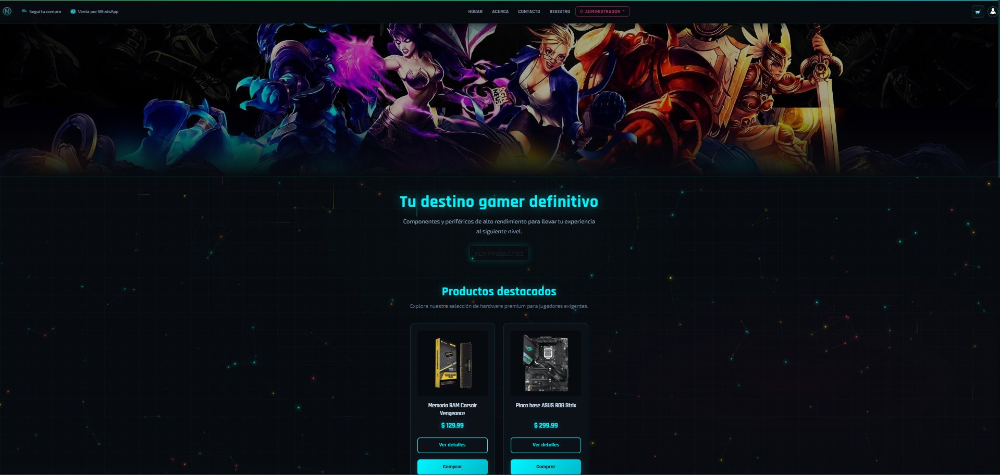
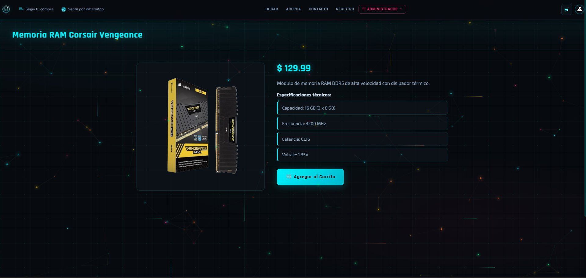

# NeonByte — Gaming E-Commerce

<div align="center">


**E-commerce full stack de componentes y periféricos gamer**

[](https://neonbyte-one.vercel.app)
[](https://neonbyte.onrender.com)
[](https://github.com/nicorodriguez23/neonbyte)
[](LICENSE)

[Ver Demo en Vivo](https://neonbyte-one.vercel.app) · [Reportar Bug](https://github.com/nicorodriguez23/neonbyte/issues) · [Sugerir Feature](https://github.com/nicorodriguez23/neonbyte/issues)

</div>

---

## Preview

| Home | Admin Panel | Detalle Producto |
|------|-------------|-----------------|
|  |  |  |

---

## Features

### E-Commerce
- Catálogo de productos con filtros por categoría
- Carrito de compras persistente en `localStorage`
- Flujo completo de compra: carrito → orden → comprobante de pago
- Comprobante imprimible con diseño profesional

### Autenticación & Seguridad
- Registro y login con **JWT** (JSON Web Tokens)
- Sistema de **roles** diferenciados: `admin` / `cliente`
- **Auto-logout por inactividad** — cierre de sesión automático a los 10 minutos
- Contraseñas encriptadas con **bcrypt**
- Token almacenado y validado en cada request al backend

### Panel de Administración
- **CRUD completo** de productos y usuarios
- Gestión de categorías, precios e imágenes
- Protección de rutas por rol — solo admins acceden
- Tablas con scroll horizontal adaptadas a mobile

### Diseño & UX
- **Design system** propio con variables CSS (colores, tipografías, radios, animaciones)
- Fondo animado con **Canvas API**: partículas flotantes + circuito RGB
- Barra RGB animada con gradiente cyan/pink/green
- Tipografías gaming: **Rajdhani** + **Exo 2**
- **100% responsive** — mobile, tablet y desktop
- Menú lateral mobile con backdrop y animaciones
- Notificaciones toast personalizadas con react-toastify

---

## Tech Stack

### Frontend
| Tecnología | Uso |
|-----------|-----|
| React 18 + Vite | UI y bundling |
| React Router DOM | Navegación SPA |
| Axios | Comunicación con la API |
| CSS Variables + Custom Design System | Estilos globales |
| Canvas API (vanilla) | Animaciones de fondo |
| react-toastify | Notificaciones |

### Backend
| Tecnología | Uso |
|-----------|-----|
| Node.js + Express | Servidor REST API |
| MongoDB Atlas + Mongoose | Base de datos |
| JWT | Autenticación stateless |
| bcrypt | Hash de contraseñas |
| Multer | Upload de imágenes |
| CORS + Helmet | Seguridad HTTP |

### Deploy
| Servicio | Descripción |
|---------|-------------|
| Vercel | Frontend — deploy automático desde `main` |
| Render | Backend — servidor Node.js en producción |
| MongoDB Atlas | Base de datos en la nube |

---

## Estructura del Proyecto

```
neonbyte/
├── frontend/
│   ├── src/
│   │   ├── components/        # Navbar, Footer, Header, ParticleBackground
│   │   ├── pages/             # Home, Login, Register, Carrito, Admin...
│   │   ├── styles/            # CSS por componente + global.css
│   │   ├── services/          # api.js (Axios instance)
│   │   ├── utils/             # auth.js, toast.js
│   │   └── assets/            # Imágenes y recursos estáticos
│   └── vite.config.js
│
└── backend/
    ├── controllers/           # Lógica de negocio
    ├── models/                # Schemas de Mongoose
    ├── routes/                # Endpoints de la API
    ├── middlewares/           # Auth JWT, validaciones
    ├── server.js
    └── .env                   # Variables de entorno (no incluido en repo)
```

---

## Instalación Local

### Pre-requisitos
- Node.js >= 18
- MongoDB Atlas (cuenta gratuita) o MongoDB local
- npm o yarn

### 1 — Clonar el repositorio
```bash
git clone https://github.com/nicorodriguez23/neonbyte.git
cd neonbyte
```

### 2 — Configurar el Backend
```bash
cd backend
npm install
```

Crear el archivo `.env`:
```env
MONGO_URI=tu_string_de_conexion_mongodb
JWT_SECRET=una_clave_secreta_larga_y_segura
PORT=5000
```

Iniciar el servidor:
```bash
npm run dev
```

### 3 — Configurar el Frontend
```bash
cd ../frontend
npm install
```

Crear el archivo `.env`:
```env
VITE_API_BASE_URL=http://localhost:5000/api
```

Iniciar el frontend:
```bash
npm run dev
```

### 4 — Abrir en el navegador
```
http://localhost:5173
```

---

## Credenciales de Demo

| Rol | Email | Contraseña |
|-----|-------|-----------|
| Admin | admin@neonbyte.com | admin123 |
| Cliente | anamartinez@gmail.com | 123456 |

> Estas credenciales son solo para explorar el proyecto. No usar en producción.

---

## API Endpoints

### Usuarios
| Método | Endpoint | Descripción | Auth |
|--------|----------|-------------|------|
| POST | `/api/usuarios/login` | Iniciar sesión | No |
| POST | `/api/usuarios/register` | Registrar usuario | No |
| GET | `/api/usuarios/perfil` | Obtener perfil | Token |
| GET | `/api/usuarios` | Listar usuarios | Admin |
| PUT | `/api/usuarios/:id` | Editar usuario | Admin |
| DELETE | `/api/usuarios/:id` | Eliminar usuario | Admin |

### Productos
| Método | Endpoint | Descripción | Auth |
|--------|----------|-------------|------|
| GET | `/api/productos` | Listar productos | No |
| GET | `/api/productos/:id` | Obtener producto | No |
| POST | `/api/productos` | Crear producto | Admin |
| PUT | `/api/productos/:id` | Editar producto | Admin |
| DELETE | `/api/productos/:id` | Eliminar producto | Admin |

### Órdenes
| Método | Endpoint | Descripción | Auth |
|--------|----------|-------------|------|
| POST | `/api/ordenes` | Crear orden | Token |
| GET | `/api/ordenes/mis-ordenes` | Mis órdenes | Token |
| GET | `/api/ordenes` | Todas las órdenes | Admin |

---

## Roadmap

- [ ] Integración con pasarela de pagos real (MercadoPago / Stripe)
- [ ] Sistema de reseñas y calificaciones de productos
- [ ] Búsqueda y filtros avanzados en el catálogo
- [ ] Upload de imágenes a Cloudinary en lugar de Multer local
- [ ] Refresh token para sesiones más largas
- [ ] Testing con Jest + React Testing Library
- [ ] PWA — Progressive Web App

---

## Autor

**Nicolás Rodriguez**

[](https://www.linkedin.com/in/nicolas-rodriguez-tech)
[](https://github.com/nicorodriguez23)

---

<div align="center">

**NeonByte — Tu destino gamer definitivo**

</div>
